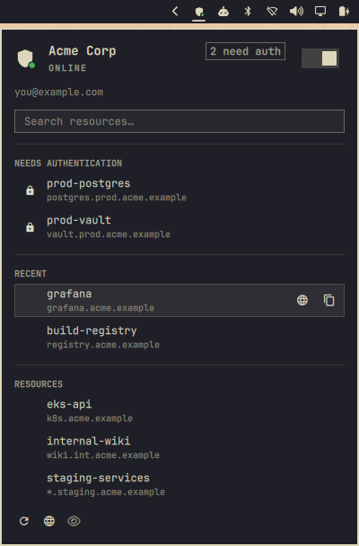

## Twingate for Omarchy

Twingate state in the bar. Every resource one keystroke away.

`shield + status dot` · `connect / disconnect` · `resource search` · `recents` · `copy address` · `open in browser` · `per-resource auth` · `exit nodes` · `accounts`



### Why

Two questions come up all day: is the tunnel up, and what is the address of one
particular host. Both should be a glance and a keystroke, not a terminal.

### Install

```
omarchy plugin add https://github.com/hgranillo/omarchy-twingate.git --enable
omarchy bar move io.github.hgranillo.twingate --section right
```

Run `twingate setup` once first. An unconfigured client reports `Not configured`.

### Requirements

Each tool gates one section. A partial install degrades; it does not fail.

| Tool | Gates |
|---|---|
| `twingate-notifier` | Everything |
| `systemctl` | The connect / disconnect switch, and the sign-in prompt check |
| `twingate` | Exit nodes and accounts |
| `wl-copy` | Copy actions. Without it the panel refuses the copy and says so |
| `omarchy-launch-browser` | Open in browser. Without it those actions are hidden |
| `notify-send` | Connection-change notifications |
| `git` | The update check |

### Using it

| Action | Effect |
|---|---|
| Left click | Open the panel |
| Right click | Connect or disconnect |
| Middle click | Re-probe the CLI and refresh |

| Key | Action |
|---|---|
| `j` / `k` or arrows | Move the cursor |
| `enter` / `space` | Activate the current row |
| `/` | Focus the search box |
| `t` | Connect or disconnect |
| `c` | Copy the selected address |
| `o` | Open the selected resource in the browser |
| `a` | Authenticate the selected resource |
| `r` | Refresh everything |
| `H` | Toggle hidden resources |
| `esc` | Close the panel, or leave the search box |

Clicking a row copies its address. Copy and open-in-browser buttons appear only
on the row under the cursor. Point at a row to see its full address and the auth
time left.

A glyph marks only what needs attention: a lock for never-authorized, red for
lapsed. Healthy rows carry no mark.

With the cursor on the search box, `enter` and `c` act on the top result. Finding
and copying a resource is `/`, a few letters, `enter`.

### Recents

Copying or opening a resource records it. The five most recent appear in
`RECENT`, lifted out of the full list so nothing shows twice, and the section
hides while you filter. The panel drops a name that no longer resolves.

### Long resource lists

Resources that need authentication pin to the top, then recents, search box above
both. The resource list clips at `maxResourceRows` with a `+N more` footer; set
it to `0` to draw every resource. The auth list clips at six regardless, so the
search box stays reachable.

A wildcard address such as `*.staging.example` gets no open-in-browser action. A
wildcard is not a host.

### The icon

A shield in the bar's own colour, dimmed whenever Twingate is not online, with a
status dot.

| Dot | Meaning |
|---|---|
| Green | Connected |
| Red | Disconnected, or the service is stopped |
| Yellow | Daemon not answering, client not configured, authenticating, or an authorization expired |

Never-authorized resources do not turn the dot yellow. A network can hold
resources that stay locked forever, and an icon lit permanently signals nothing.
The panel pins them in `NEEDS AUTHENTICATION` and counts them in the header.

The shield is `QtQuick.Shapes` geometry, not an SVG, so it follows the theme and
avoids Qt SVG quirks at bar size. Omarchy has no success or warning colour
tokens, so the dot colours are fixed. Override `connectedColor`,
`disconnectedColor`, or `problemColor` on `TwingateIcon`.

### Signing in

**Per resource.** Some resources need their own authorization. The panel pins
them in `NEEDS AUTHENTICATION`. Activating one runs
`twingate-notifier auth <name>` and hands off to the browser.

**Your session.** This one is push-based, so nothing triggers it on demand. The
daemon raises the request on `/run/twingate/auth.sock`, and the
`twingate-desktop-notifier` user service turns it into the notification that
opens your browser.

A stopped notifier service fails silently. Twingate needs you to sign in and
cannot ask. The panel watches it and offers **Turn on Twingate sign-in prompts**.
That is a user unit, so starting it needs no authentication.

The header reads `Session expires in 5 hours` or `Session expired` when
re-authentication is due, and nothing otherwise. Non-locked resources share the
session policy of the account, so the nearest `auth_expires_at` among them is the
session expiry. It is 0 everywhere when no policy requires timed re-auth.

The daemon's own token carries an `exp`, visible in `journalctl -u twingate`, but
it is a rolling three-day window refreshed every few minutes. It is not a
deadline, so the panel ignores it.

### Connecting needs authentication

Twingate has no unprivileged pause. `start`, `stop`, `connect` and `disconnect`
all shell out to `sudo systemctl start|stop twingate`, and `start` and `connect`
also block reading stdin.

So the widget runs `systemctl start|stop twingate.service` directly, with no
`sudo` and no `pkexec`. systemd asks polkit, and Omarchy's own polkit agent shows
the dialog. `org.freedesktop.systemd1.manage-units` is `auth_admin_keep`, so you
authenticate once per session. Cancelling is safe. The switch snaps back.

[`contrib/49-omarchy-twingate.rules`](contrib/49-omarchy-twingate.rules) drops
that prompt, scoped to `twingate.service` and your user. Nothing installs it. In
exchange, any process running as you can stop your tunnel silently.

Everything else is unprivileged: reading status, listing resources,
authenticating a resource, switching exit nodes and accounts.

### When something is missing

These rows join the keyboard cursor like any other. All but one open Omarchy's
presented terminal, so you see the command before it runs. The sign-in prompt row
is the exception. It starts a user unit directly.

| State | The panel offers |
|---|---|
| `twingate` is not on PATH | [**Install Twingate**](https://www.twingate.com/docs/linux#pacman-arch-linux) |
| Sign-in prompts are not delivered | **Turn on Twingate sign-in prompts**, running `systemctl --user enable --now twingate-desktop-notifier` |
| Installed but no network configured | **Finish Twingate setup**, running `sudo twingate setup` |
| The checkout is behind its origin | **Update this panel**, running `omarchy plugin update <id> && omarchy-restart-shell` |

Omarchy never pulls plugin checkouts, so this plugin can watch its own. That
check is off by default. Turn on `checkForUpdates` and the panel asks GitHub once
a day whether the checkout is behind, then offers the row above. It skips a
checkout that is ahead, diverged, or symlinked into a working tree. It downloads
nothing until you choose the row, and the row shows the diff and asks first.
Restart the shell afterwards to load the update.

### Data

No data file of its own. Settings and the last five resource names live inline on
the widget's entry in `~/.config/omarchy/shell.json`:

```json
{
  "id": "io.github.hgranillo.twingate",
  "showHidden": false,
  "recentResources": ["build-registry", "Grafana"]
}
```

It reads only the local client (`twingate-notifier status` and `resources`,
`twingate account list`, `twingate exit-node list`), plus `which` to see what is
installed and `systemctl is-active` for the two services.
It never sends resource names, addresses or your email anywhere. It writes only
the five recent names shown above to disk, in `shell.json` (mode 0600). Anything
that backs up or syncs that file carries them too. Set `maxRecentResources` to
`0` to keep none.

One outbound connection: the optional daily `git fetch` of its own checkout.
`checkForUpdates: false` makes it fully offline. There is no telemetry.

### Settings

Configure through _Setup > Plugins_, or inline on the widget's `shell.json` entry.

| Key | Default | Meaning |
|---|---|---|
| `statusIntervalSec` | `10` | Status poll interval. I have seen the daemon stop answering under frequent polling, so keep it conservative. |
| `resourcesIntervalSec` | `60` | Resource list interval. Expiry countdowns update locally between polls. |
| `showHidden` | `false` | Include hidden resources, matching `twingate resources --all`. |
| `notifications` | `true` | Notify on connection changes. |
| `maxResourceRows` | `12` | Rows before a list clips. `0` draws every resource. |
| `checkForUpdates` | `false` | Check daily whether the checkout is behind its origin, and offer an update. Reaches GitHub. |
| `maxRecentResources` | `5` | Names kept in `shell.json` for `RECENT`. `0` stores none. |

### IPC

```
omarchy-shell io.github.hgranillo.twingate status            # Online | Offline | Service stopped | ...
omarchy-shell io.github.hgranillo.twingate network           # the Twingate network name
omarchy-shell io.github.hgranillo.twingate list              # name, address, expiry per line
omarchy-shell io.github.hgranillo.twingate toggle            # open or close the panel
omarchy-shell io.github.hgranillo.twingate connect
omarchy-shell io.github.hgranillo.twingate disconnect
omarchy-shell io.github.hgranillo.twingate toggleConnection
omarchy-shell io.github.hgranillo.twingate auth <name>
omarchy-shell io.github.hgranillo.twingate refresh
```

Bind `toggle` to a key in `~/.config/hypr/bindings.conf` to summon the panel.

### Remove

```
omarchy plugin remove io.github.hgranillo.twingate --yes
```

### Development

Symlink your checkout so edits land with no copy step:

```
ln -s "$PWD" ~/.config/omarchy/plugins/io.github.hgranillo.twingate
omarchy plugin enable io.github.hgranillo.twingate --section right
omarchy plugin validate .
```

The shell loads a symlinked directory fine. `omarchy plugin validate` refuses one
without a trailing slash: its check is `find "$dir" -type l`, which flags the
directory itself.

Placement takes `--section`, `--index`, and `--before` / `--after`. `--before` and
`--after` fail unless the bar already carries the widget you name, so `--section`
is the portable form.

A bar widget edit needs a restart. A save logs a reload, but the running bar
keeps the component it loaded first. The first `IpcHandler` registration owns its
target for the process lifetime.

```
omarchy-restart-shell
qs log -p "$OMARCHY_PATH/shell" --tail 100
```

Never use `omarchy-refresh-shell`. It resets `shell.json` to defaults and would
discard your bar layout.

Parsing and formatting live in `Model.js` as pure functions with no QML imports,
so they run under plain node:

```
node --test tests/*.test.js
```

`tests/manifest.test.js` mirrors `omarchy plugin validate`, so a broken manifest
fails here instead of in the shell. `tests/fixtures/resources.json` is a synthetic
payload with fixed timestamps. It covers shapes a healthy network never shows: an
expired authorization, a hidden resource, a wildcard address.

`qmllint` exits non-zero with no output on any file that uses inline `component`
declarations, including Omarchy's own panels. Use it on `Service.qml` and
`TwingateIcon.qml` only.

`Validate` runs the suite on every push and pull request, and checks the install
line above still points here. `Release` fires on a `v*` tag: it tests, refuses a
tag that disagrees with `manifest.json`, skips an existing release, and writes
notes from the commits since the previous tag. A release is a version
bump, a commit, and a tag:

```
git tag v1.1.0 && git push --tags
```

### License

MIT. See [LICENSE](LICENSE).
